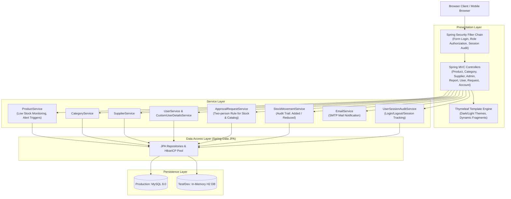
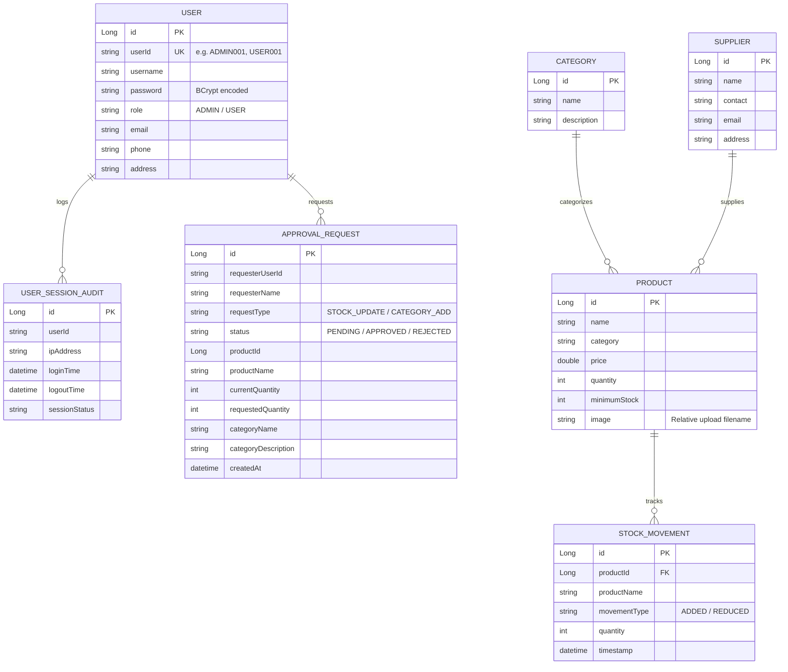

# 📦 Enterprise Inventory Management System (IMS)

[](https://openjdk.org/projects/jdk/17/)
[](https://spring.io/projects/spring-boot)
[](https://spring.io/projects/spring-security)
[](https://www.mysql.com/)
[](https://www.docker.com/)
[](https://github.com/features/actions)

A production-grade, enterprise web application designed for streamlined inventory tracking, role-based access governance, stock movement auditing, dual-approval workflows, and low-stock automated alerts. Built with modern **Spring Boot 4**, **Spring Security**, **Spring Data JPA / Hibernate**, **Thymeleaf**, **Apache POI**, and containerized for turnkey deployment.

---

## 🏗️ Architecture & Component Overview



---

## 🗄️ Entity-Relationship Model



---

## 🚀 Key Improvements & Enterprise Refactoring

| Area | Before | Enterprise Refactored State |
| :--- | :--- | :--- |
| **Directory Structure** | Cluttered nested directories (`inventry/inventory-management-system/`) with typos and 23MB PPTX/XLSX dumped in root | Clean root-level Maven layout; project assets and agile tracking sheets organized in `docs/` |
| **Security & Secrets** | Leaked Gmail App password & plaintext MySQL credentials in version control | Purged all hardcoded secrets; replaced with 12-factor environment variable interpolation with safe defaults; created `.env.example` |
| **Application Entrypoint** | Duplicate `@SpringBootApplication` classes causing packaging ambiguity | Unified into single canonical `InventoryManagementApplication` |
| **Cross-Platform Storage** | Hardcoded Windows path (`C:/inventory-images/`) breaking Linux/Mac/Docker | OS-agnostic configurable `app.upload.dir` with dynamic URI resolution in `WebConfig` |
| **Database & Testing** | Rigid local MySQL dependency causing tests to fail when MySQL is offline | Integrated in-memory H2 database test profile (`application-test.properties`) allowing instant, zero-dependency CI runs |
| **Automated Test Suite** | Single empty test class | 26 unit and integration tests covering Products, Categories, Users, Approval workflows, and Spring Security authorization |
| **Containerization** | None | Production multi-stage `Dockerfile` with non-root security user & `docker-compose.yml` with MySQL health checks |
| **CI/CD** | None | GitHub Actions CI workflow (`.github/workflows/ci.yml`) validating builds and test passes on every push and PR |

---

## 🔑 Default Credentials

The application seeds default users upon startup via `UserDataInitializer`:

| Role | User ID | Password | Access Level |
| :--- | :--- | :--- | :--- |
| **Admin** | `ADMIN001` | `admin123` | Full administrative controls: product CRUD, category CRUD, supplier CRUD, user management, approval workflows, Excel exports, audit logs |
| **Standard User** | `USER001` | `user123` | Operational view: inventory catalog, low-stock alerts, stock update requests, category creation requests, password management |

---

## ⚙️ Configuration & Environment Variables

Copy `.env.example` to `.env` or set the following environment variables:

| Variable | Description | Default Value |
| :--- | :--- | :--- |
| `SERVER_PORT` | HTTP port the application listens on | `9090` |
| `SPRING_DATASOURCE_URL` | JDBC URL for MySQL database | `jdbc:mysql://localhost:3306/inventory_db?...` |
| `SPRING_DATASOURCE_USERNAME` | Database username | `root` |
| `SPRING_DATASOURCE_PASSWORD` | Database password | *(empty)* |
| `APP_UPLOAD_DIR` | Image uploads filesystem directory | `./uploads/images/` |
| `SPRING_MAIL_HOST` | SMTP server host | `smtp.gmail.com` |
| `SPRING_MAIL_PORT` | SMTP server port | `587` |
| `SPRING_MAIL_USERNAME` | SMTP authentication username | *(empty)* |
| `SPRING_MAIL_PASSWORD` | SMTP authentication password / app password | *(empty)* |
| `LOW_STOCK_RECIPIENT_EMAIL` | Destination email for automated low-stock warnings | `admin@inventory.local` |

---

## 🛠️ Local Development & Testing

### Prerequisites
- **JDK 17** or higher (`java -version`)
- **MySQL 8.0+** (for local runs) or **Docker**

### 1. Run Automated Test Suite
The test suite utilizes an in-memory H2 database with zero external dependencies:
```bash
./mvnw clean test
```

### 2. Run Application Locally
```bash
./mvnw spring-boot:run
```
Access the application at [http://localhost:9090](http://localhost:9090).

### 3. Build Executable Jar
```bash
./mvnw clean package
java -jar target/inventory-system-0.0.1-SNAPSHOT.jar
```

---

## 🐳 Docker & Turnkey Deployment

### Run with Docker Compose
Spin up the Spring Boot application and a MySQL 8.0 container with persistent volumes:
```bash
docker compose up --build -d
```

### Check Logs & Status
```bash
docker compose ps
docker compose logs -f app
```

To shut down:
```bash
docker compose down
```

---

## 📂 Repository Organization

```text
├── .github/
│   └── workflows/
│       └── ci.yml                 # Automated Maven test & build pipeline
├── docs/
│   ├── presentation/              # System architecture & slide deck
│   └── project_management/        # Agile tracking & sprint backlog
├── src/
│   ├── main/
│   │   ├── java/com/inventory/
│   │   │   ├── config/            # Security, Password, MVC, Audit handlers & Data seeders
│   │   │   ├── controller/        # Web MVC Controllers (Thymeleaf endpoints & REST actions)
│   │   │   ├── entity/            # JPA Data Entities (Product, User, Category, StockMovement...)
│   │   │   ├── repository/        # Spring Data JPA Repositories
│   │   │   └── service/           # Business Logic, Email alerts, and Workflow services
│   │   └── resources/
│   │       ├── static/            # CSS, JavaScript, theme togglers, and static assets
│   │       ├── templates/         # Thymeleaf HTML views (dashboards, products, approvals...)
│   │       └── application.properties # Production properties (env-var interpolated)
│   └── test/
│       ├── java/com/inventory/    # Unit & Integration test suites (26 tests)
│       └── resources/             # In-memory H2 test profile & Mockito configuration
├── .dockerignore
├── .env.example                   # Sample environment configuration
├── .gitignore
├── Dockerfile                     # Multi-stage production container build
├── docker-compose.yml             # Orchestration for App + MySQL
├── pom.xml                        # Maven dependencies & build plugins
└── README.md                      # Comprehensive documentation
```

---

## 📄 License
This project is licensed under the MIT License - see the [LICENSE](LICENSE) file for details.
